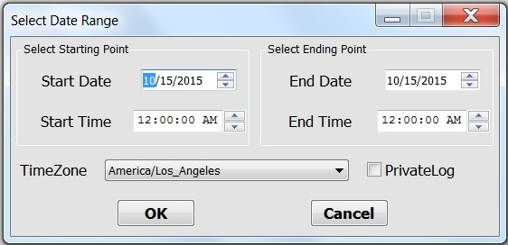
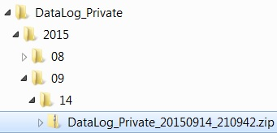

.. _define_time_range:

*******************
Define Time Range
*******************

DatViewer can search data files within the desirable date range and then concatenate such files into a H5 file.
By defaut, TimeZone is set to the local one. However, if data were taken elsewhere, select the timezone 
where data were taken. 

**Data files are saved in directory trees named by date and time:** Picarro software saves data in a directory tree 
that is named by the creation year, month and day. See, for example, the directory tree shown in the figure below. 
Select the option if the target folder has this file structure. This way DatViewer will
only search folders within the desirable date range, which may substantially reduce processsing time.

.. note:: To save processing time, DatViewer does not open data file but only determines data acquisition time by the file name. 

.. warning:: Do NOT define time range if data file name has been changed. 

.. warning:: DatViewer does NOT concatenate data files exactly within the defined time range.

This is because the time extracted from file name is different from the data acquisition time. In order to not miss data points, 
DatViewer expands the specified time range so the resulting dataset normally has a wider time range than the user specification.   

.. seealso::  :ref:`concatenate_files_timerange`