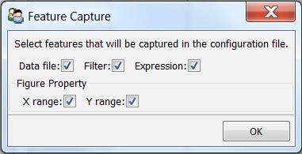
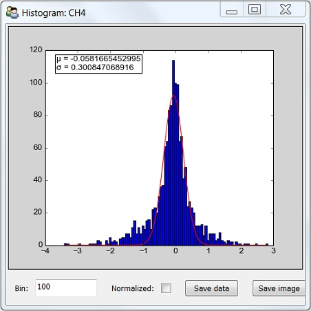

.. _menus_time_series_plot:

***************************
Menus of Time Series Plot
***************************

.. image:: _static/menus_time_series_plot.jpg

* :ref:`file_menu_time`
* :ref:`analysis_menu_time`
* :ref:`view_menu_time`

.. _file_menu_time:

File menu
=============================

.. _save_configuration:

Save configuration
------------------------

Save figure properties, expression, filter and other settings into a configuration file 
so that they can be loaded easily in the future. Properties to be saved are specified in 
the *Figure Capture* panel.

.. note:: If a feature is not captured, it will be omitted when configuration file is loaded.
 
Depending on features captured, loading configuration file can have different effects. For example:

* If all features are captured, saved workplace is reproduced.

* If *Data file* is not captured, saved parameters will be applied to data file in the memory.

* If *Expression* is not captured, plots will not be transformed.

* If X (Y) range is not captured, figures will be auto scaled on x (y) axis.

Take ScreenShot
--------------------------------------

Take a screen shot and save image as a PNG file.

.. _analysis_menu_time:

Analysis menu
=============================

Statistics
------------------------------
Calculate mean, standard deviation and peak to peak for all plots in the current window.

Histogram
------------------------------

Generate histogram of data as below:

* **Red line** is a Gaussian function fitted to the histogram. Fitting results of :math:`\mu` and :math:`\sigma` are shown in the top-left corner of the plot.

* **Bin** is the number of intervals that the range of value is divided into.

* **Normalized**: when selected, the sum of the histograms is normalized to 1.

* **Save data**: save histogram data to a CSV file.

* **Save image**: save histogram image as a JPEG/PNG/PDF file. 

.. _correlation_plot_menu:

Correlation plot
-----------------------------

Plot y-axis data in one frame versus that in the other. Enable when two or more frames exist in the current *Time Series Plot* window. 
See :ref:`correlation_plot` for details.

Allan Standard Deviation Plot
-------------------------------

Make Allan Standard Deviation Plots for data in the current window. See `Allan variance <https://en.wikipedia.org/wiki/Allan_variance>`_ for more information.

.. _view_menu_time:

View menu
=============================

* x-Axis in DateTime: x-axis data is shown in the datetime format

* x-Axis in Minute: x-axis data is in unit of minute. 

* x-Axis in Hour: x-axis data is in unit of hour.

When switching from DateTime to Minute/Hour, x-axis data is substracted by the earliest point shown in the panel, 
and then converted to desired unit. 
