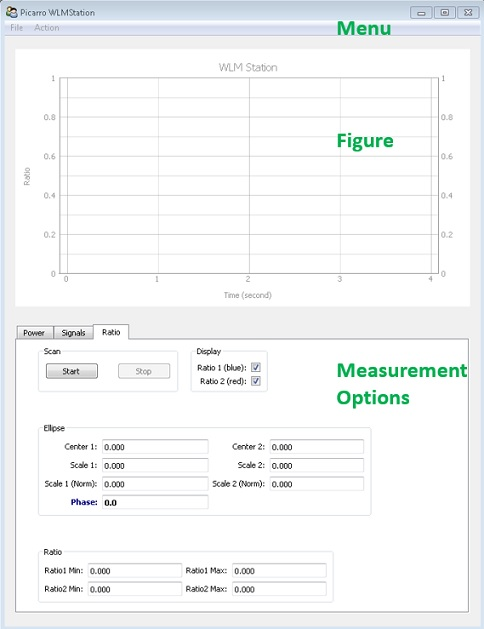
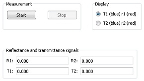
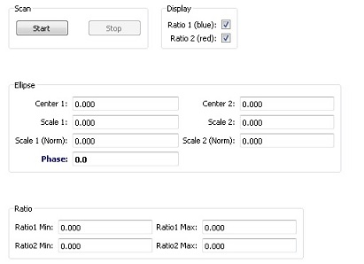
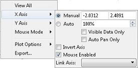
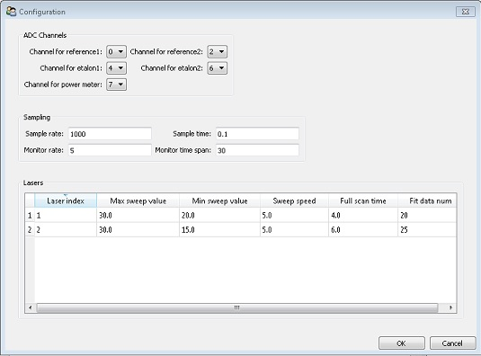

.. _user_guide:

***************
User's Guide
***************

    
**Main menu of WLMstation**

* :ref:`measure_options`

* :ref:`figure`

* :ref:`menu`

.. _measure_options: 
  
Measurement Options
============================

Power tab
----------------

.. _signals_tab:

Signals tab
---------------------

**Measurement**

* Start: start monitoring reflectance and transimittance signals

* Stop: stop monitoring reflectance and transimittance signals

**Display**

**Reflectance and transimittance signals**

.. _ratio_tab:

Ratio tab
-----------------------

**Scan**

* Start: start scan laser wave number

* Stop: stop scan laser wave number

**Display**

* Ratio 1 (blue): if checked display ratio 1 as blue curve in the figure.

* Ratio 2 (red): if checked display ratio 2 as red curve in the figure.

**Ellipse**

Fit time series of ratio 1 and ratio 2 to an ellipse function such that

* :math:`r_1(t) = C_1 + S_1 cos[\theta(t)]`

* :math:`r_2(t) = C_2 + S_2 sin[\theta(t)+\epsilon]`

where:

* :math:`r_1(t)` and :math:`r_2(t)` are time series of ratio 1 and ratio 2, respectively; 
* :math:`C_1` and :math:`C_2` correspond to Center 1 and Center 2;
* :math:`S_1` and :math:`S_2` correspond to Scale 1 and Scale 2;
* :math:`\epsilon` is the Phase. 

**Ratio**

.. _figure: 
  
Figure
============================
This is a real-time display of measurement results. Right click on the figure can bring up 
a context menu which provides zoom, transform, export and many other functions.

   
   Context menu that appears when right click on the figure.

.. _menu: 
  
Menu
============================

.. _file_menu:

File menu
-----------------------

**New WLM unit**

**Load dark current settings**

**Take screenshot**

.. _action_menu:

Action menu
-----------------------

**Laser** *N*, *N* = 1, 2, 3...

Switch to laser *N*. Multiple lasers are installed in the G2000 system. Connect desired laser to the device, and then 
select corresponding menu to inform software to switch to the correct laser setting.

**Configuration**

* ADC Channels

* Sampling

  * Sample rate: number of samples per second that ADC takes during scan.
  
  * Sample time: 

* Lasers
  
  * Laser index
  
  * Max sweep value: maximum value in sweeping laser temperature.
  
  * Min sweep value: minimum value in sweeping laser temperature.
  
  * Sweep speed: sweep speed of laser temperature in degree per second.
  
  * Full scan time: 
  
  * Fit data num: 

**Measure dark currents**

Measure average reading of photo detectors in the dark (laser turned off). By subtracting dark current from actual reading of photo detectors, 
we obtain signals that are proportional to laser power.